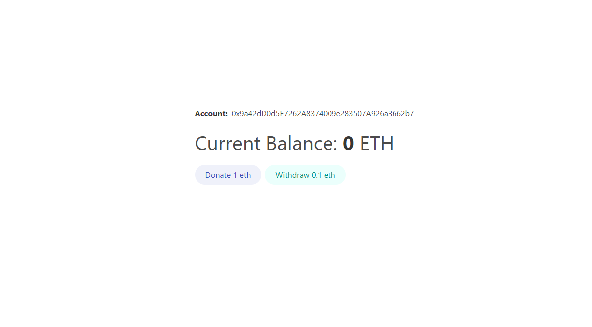

# Faucet application

Faucet application will enable users to donate and withdraw funds from the smart contract. Users will interact with a smart contract through the website connected to the blockchain network through the Metamask wallet.The front end of the application is built with React library and Bulma framework, for smart contract creation was used Truffle development environment and Ganache(private blockchain). The purpose of this application is to cover the basics while having fun working on something practical.

